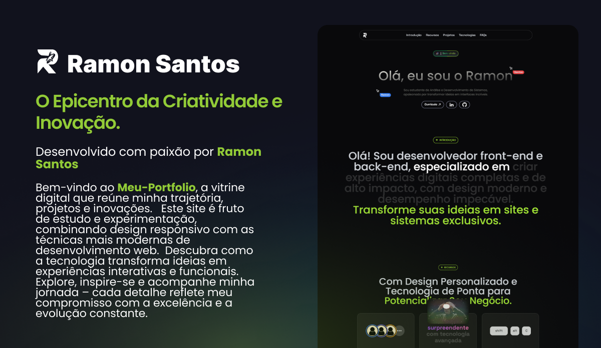

# Meu-Portfolio

Meu-Portfolio é um site pessoal moderno e interativo, desenvolvido com foco em apresentar os projetos, habilidades e experiências Minha "Ramon Santos." Ideal para profissionais e entusiastas que desejam conhecer melhor o trabalho e a trajetória deste desenvolvedor.

## Descrição

O Meu-Portfolio foi criado para ser uma vitrine completa do trabalho de Ramon Santos, oferecendo uma experiência elegante e intuitiva. O site permite explorar projetos, ler sobre experiências profissionais e entrar em contato de forma rápida e eficiente. Com um design modular e responsivo, ele se adapta a diferentes dispositivos e garante uma navegação fluida.

## Demonstração

Confira a demonstração ao vivo: [RamonSantosPortfolio](https://ramonsantosportfolio.vercel.app)

## Tecnologias Utilizadas

- **TypeScript:** Linguagem principal que oferece tipagem estática e robustez ao código.
- **CSS:** Utilizado para estilização e personalização visual do site.
- **JavaScript:** Complementa funcionalidades interativas e dinâmicas.
- **Next.js:** Framework React que possibilita renderização do lado do servidor e otimizações de performance.
- **Tailwind CSS:** Framework CSS para criação de interfaces modernas e responsivas com facilidade.

## Funcionalidades

- Interface moderna e responsiva, garantindo uma experiência de usuário de alta qualidade.
- Seção de projetos que destaca os cases e trabalhos realizados.
- Estrutura modular e escalável para facilitar atualizações e novas implementações.
- Integração com redes sociais e formulário de contato para facilitar a comunicação.
- Design pensado para oferecer clareza e objetividade na apresentação do portfólio.
